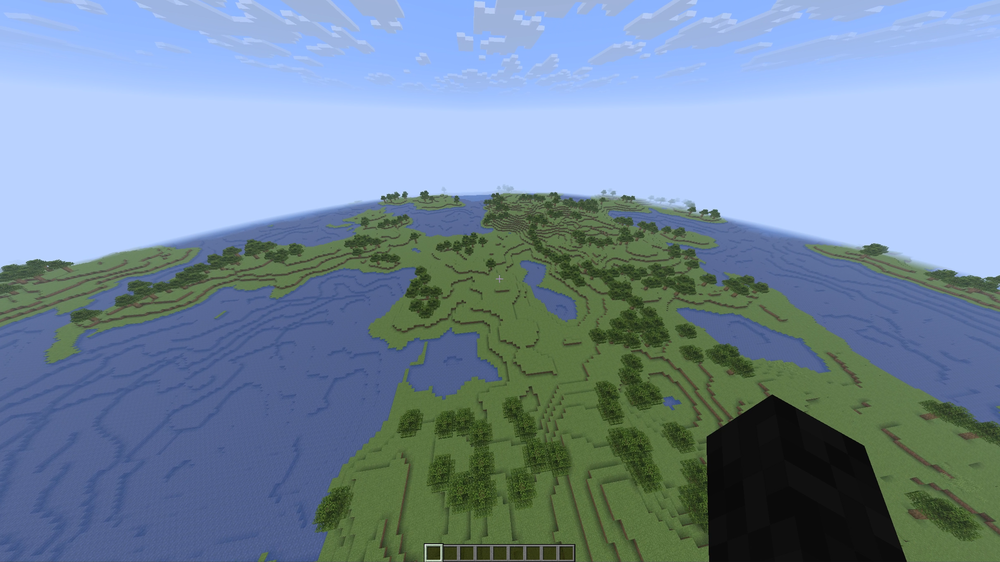

# UCraft
A lightweight **Minecraft server implementation written in C**, designed for machines with limited resources.

<p align="center">
  
</p>
<p align="center"><em>Procedurally generated terrain</em></p>

UCraft implements just the bare essentials of the Minecraft protocol: clients can join,
explore a procedurally generated world, chat, and break and place blocks. It provides the
foundation for **very primitive Minecraft gameplay** — not a full server replacement.

Currently supports **Minecraft 26.1.2** clients.

## Features

- **Procedural terrain generation** — an explorable world generated on demand as players move around
- **Primitive Minecraft gameplay** — walk around, chat with other players, and break/place blocks
- **Online-mode encryption** — authenticated logins through mbedTLS, or offline mode without it
- **Tiny footprint** — ~46K-byte binary without authentication (~70K with), and ~50K bytes of memory on average (for a single player)

## Building

The server was built and tested on Linux. On Windows, MSVC is required and on macOS, Xcode Command Line Tools and CMake are required.

```bash
sudo apt install git build-essential cmake make
git clone https://github.com/<dein-fork>/UCraft.git
cd UCraft
mkdir build && cd build
cmake .. -DCMAKE_DISABLE_FIND_PACKAGE_MbedTLS=TRUE
make
```
This produces an executable named `UCraft` in `build/src`.

Pre-built binaries are also available as artifacts of the [GitHub Actions](https://github.com/vimpop/UCraft/actions) workflow runs.

## Running only in RAM

```bash
./src/UCraft
[INFO]: Listening on *:25565
[INFO]: UCraft server started!
```

Then connect to `localhost:25565` with a Minecraft **26.1.2** client.

## Running persistent

```bash
./src/UCraft -save=save.uc
[INFO]: Listening on *:25565
[INFO]: UCraft server started!
```

Then connect to `localhost:25565` with a Minecraft **26.1.2** client.

## Running persistent and with custom port

```bash
./src/UCraft -port=12345 -save=save.uc
[INFO]: Listening on *:12345
[INFO]: UCraft server started!
```

Then connect to `localhost:12345` with a Minecraft **26.1.2** client.

## Implementations

- **Lightbulb** (BL602 MCU) — implementation details [here](https://github.com/vimpop/UCraft-bl602)
- **Samsung C410W Printer** (ARM BE MCU) - implementation details [here](https://github.com/vimpop/UCraft-printer)

*Your implementation could also be here! (feel free to open up a issue with your implementation)*

## Credits

- [Bixilon](https://bixilon.de/en) for help with major parts of the Minecraft protocol
- [wiki.vg](https://wiki.vg/Main_Page) for documenting Minecraft's protocol

## License

[MIT](LICENSE.txt)
